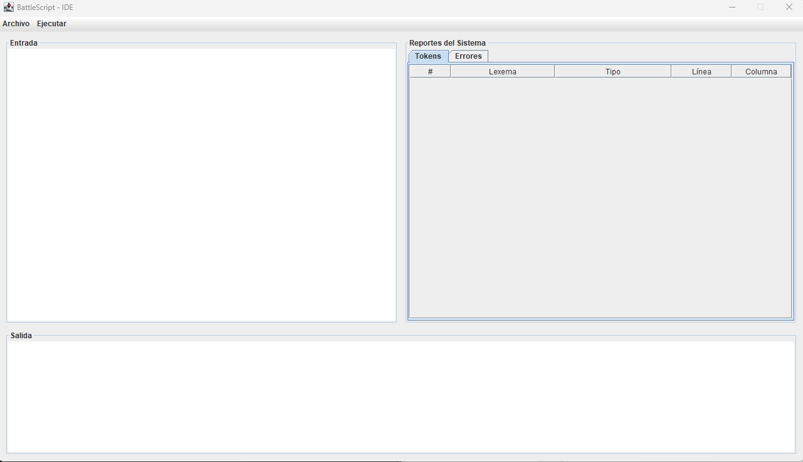

# Manual de Usuario - IDE BattleScript

## 1. Introducción
Bienvenido al Entorno de Desarrollo Integrado (IDE) de **BattleScript**. Esta aplicación de escritorio ha sido diseñada para brindarte una experiencia fluida al momento de escribir, analizar y depurar tus estrategias de combate y configuraciones de partidas. 

Gracias a su interfaz adaptable, podrás visualizar tu código y los reportes del sistema simultáneamente, optimizando tu flujo de trabajo (especialmente si utilizas monitores de formato amplio o curvos).

## 2. Entorno de Trabajo (Interfaz Principal)
Al iniciar la aplicación, te encontrarás con una ventana maximizada dividida estratégicamente en tres secciones principales:
1. **Área de Edición (Izquierda):** Un lienzo en blanco donde podrás redactar tu código fuente en lenguaje BattleScript.
2. **Panel de Reportes (Derecha):** Un sistema de pestañas (`Tokens` y `Errores`) que tabulará los resultados de tus análisis.
3. **Consola de Salida (Abajo):** Una bitácora que te informará sobre el estado de la ejecución (éxito o advertencias).

---

## 3. Gestión de Archivos
El IDE cuenta con una barra de menú superior con la pestaña **"Archivo"**, que te permite gestionar tu código fácilmente.

### Crear un Nuevo Archivo
Si deseas empezar desde cero, haz clic en **Archivo > Nuevo**. Esto limpiará inmediatamente el área de edición de código y los reportes anteriores, dándote un espacio de trabajo totalmente en blanco.

### Guardar un Archivo
Para no perder tus estrategias:
1. Dirígete a **Archivo > Guardar Archivo**.
2. Se abrirá el explorador de archivos de tu sistema operativo.
3. Elige la carpeta destino, escribe el nombre del archivo y presiona Guardar. 
*Nota: El sistema asignará automáticamente la extensión `.btl` si no la incluyes.*

### Abrir un Archivo Existente
1. Ve a **Archivo > Abrir**.
2. El explorador de archivos aplicará automáticamente un filtro para mostrarte únicamente los archivos válidos de BattleScript (`*.btl`).
3. Selecciona tu archivo y su contenido se cargará inmediatamente en el área de edición.

---

## 4. Ejecución y Análisis de Código
Una vez que hayas escrito o cargado tu código, es hora de poner a prueba el motor de compilación.

1. Dirígete a la barra de menú superior y haz clic en **Ejecutar > Analizar Código**.
2. El motor leerá tu texto instantáneamente. 
3. Revisa la **Consola de Salida** en la parte inferior. Si tu código es perfecto, verás un mensaje de éxito: `✅ ¡Análisis completado exitosamente!`.

---

## 5. Reportes Generados
El sistema no solo valida tu código, sino que lo desglosa para que entiendas exactamente cómo está siendo interpretado.

### Reporte de Tokens
En el panel derecho, selecciona la pestaña **"Tokens"**. Si tu código no contiene caracteres extraños, aquí verás una tabla detallada con cada componente léxico encontrado, indicando su:
* Número correlativo (`#`)
* Lexema (la palabra escrita)
* Tipo (Acción, Reservada, Identificador, etc.)
* Ubicación exacta (Línea y Columna)

### Reporte de Errores (Léxicos y Sintácticos)
¿Cometiste un error? ¡No te preocupes! El IDE no se cerrará. Si ingresas un símbolo no válido (como `@` o `$`) o si olvidas una llave `}`, el sistema lo atrapará.
Ve a la pestaña **"Errores"** en el panel derecho. Aquí encontrarás una tabla que te indicará:
* Si el error es Léxico (carácter inválido) o Sintáctico (error de gramática).
* Una descripción detallada del problema.
* La Línea y Columna exactas donde debes ir a corregirlo.

