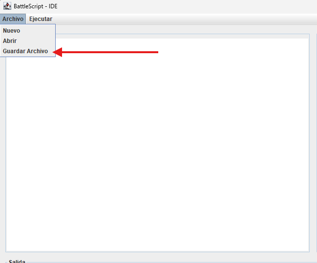
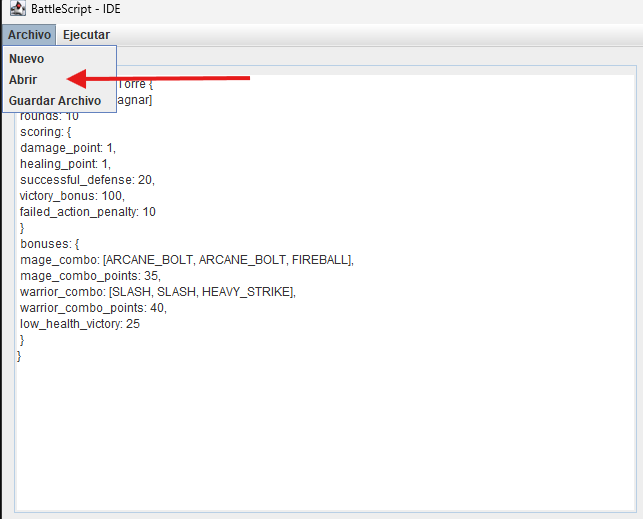
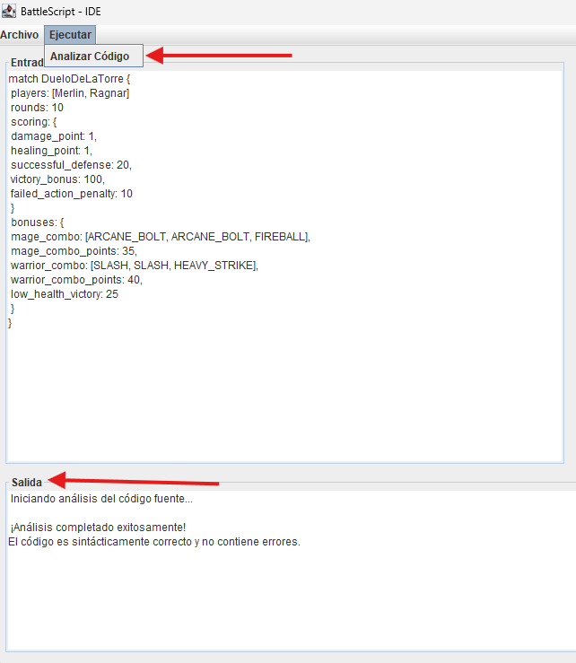
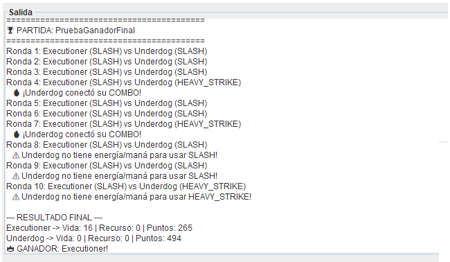
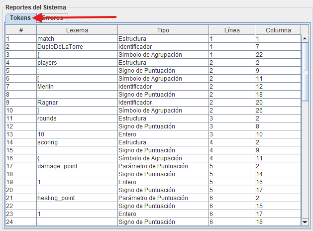
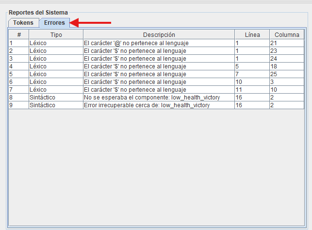

# Manual de Usuario - IDE BattleScript

## 1. Introducción
Bienvenido al Entorno de Desarrollo Integrado (IDE) de **BattleScript**. Esta aplicación de escritorio ha sido diseñada para brindarte una experiencia fluida al momento de escribir, analizar, depurar y **ejecutar** tus estrategias de combate y configuraciones de partidas.

Gracias a su interfaz adaptable, podrás visualizar tu código, los reportes del sistema y el resultado de tus simulaciones de combate simultáneamente, optimizando tu flujo de trabajo (especialmente si utilizas monitores de formato amplio o curvos).

## 2. Entorno de Trabajo (Interfaz Principal)
Al iniciar la aplicación, te encontrarás con una ventana maximizada dividida estratégicamente en tres secciones principales:
1. **Área de Edición (Izquierda):** Un lienzo en blanco donde podrás redactar tu código fuente en lenguaje BattleScript.
2. **Panel de Reportes (Derecha):** Un sistema de pestañas (`Tokens` y `Errores`) que tabulará los resultados de tus análisis.
3. **Consola de Salida (Abajo):** Una bitácora que te informará sobre el estado del análisis y, si tu código es válido, sobre el desarrollo completo de las batallas simuladas — ronda por ronda, con las acciones elegidas, combos, advertencias y el resultado final.


---

## 3. Gestión de Archivos
El IDE cuenta con una barra de menú superior con la pestaña **"Archivo"**, que te permite gestionar tu código fácilmente.

### Crear un Nuevo Archivo
Si deseas empezar desde cero, haz clic en **Archivo > Nuevo**. Esto limpiará inmediatamente el área de edición de código y los reportes anteriores, dándote un espacio de trabajo totalmente en blanco.

### Guardar un Archivo
Para no perder tus estrategias:
1. Dirígete a **Archivo > Guardar Archivo**.
2. Se abrirá el explorador de archivos de tu sistema operativo.
3. Elige la carpeta destino, escribe el nombre del archivo y presiona Guardar. 
*Nota: El sistema asignará automáticamente la extensión `.btl` si no la incluyes.*



### Abrir un Archivo Existente
1. Ve a **Archivo > Abrir**.
2. El explorador de archivos aplicará automáticamente un filtro para mostrarte únicamente los archivos válidos de BattleScript (`*.btl`).
3. Selecciona tu archivo y su contenido se cargará inmediatamente en el área de edición.



---

## 4. Ejecución y Análisis de Código
Una vez que hayas escrito o cargado tu código, es hora de poner a prueba el motor de compilación.

1. Dirígete a la barra de menú superior y haz clic en **Ejecutar > Analizar Código**.
2. El motor leerá tu texto instantáneamente, realizando el análisis léxico y sintáctico.
3. Revisa la **Consola de Salida** en la parte inferior:
   * Si tu código tiene errores léxicos o sintácticos, el análisis se detiene ahí y los detalles del problema se listan en la pestaña **Errores** (ver sección 6).
   * Si tu código es válido, el motor **ejecuta automáticamente** todas las partidas indicadas en el bloque `main` de tu archivo, y el desarrollo completo de cada batalla se imprime en la Consola de Salida (ver sección 5).



---

## 5. Simulación de Combates

Si tu archivo `.btl` pasó el análisis léxico y sintáctico sin errores, el IDE no se detiene ahí: **interpreta y ejecuta** las estrategias, partidas y bloques `run` que definiste, y muestra el resultado completo de cada combate directamente en la Consola de Salida.

### 5.1 Cómo se ve una simulación

Por cada partida que se ejecuta, la consola muestra un encabezado con el nombre de la partida, seguido de una línea por cada ronda jugada, y termina con un bloque de resultado final:

```
=========================================
🏆 PARTIDA: PruebaGanadorFinal
=========================================
Ronda 1: Executioner (SLASH) vs Underdog (SLASH)
Ronda 2: Executioner (SLASH) vs Underdog (SLASH)
Ronda 3: Executioner (SLASH) vs Underdog (SLASH)
Ronda 4: Executioner (SLASH) vs Underdog (HEAVY_STRIKE)
   🔥 ¡Underdog conectó su COMBO!
Ronda 5: Executioner (SLASH) vs Underdog (SLASH)
Ronda 6: Executioner (SLASH) vs Underdog (SLASH)
Ronda 7: Executioner (SLASH) vs Underdog (HEAVY_STRIKE)
   🔥 ¡Underdog conectó su COMBO!
Ronda 8: Executioner (SLASH) vs Underdog (SLASH)
   ⚠️ Underdog no tiene energía/maná para usar SLASH!
Ronda 9: Executioner (SLASH) vs Underdog (SLASH)
   ⚠️ Underdog no tiene energía/maná para usar SLASH!
Ronda 10: Executioner (SLASH) vs Underdog (HEAVY_STRIKE)
   ⚠️ Underdog no tiene energía/maná para usar HEAVY_STRIKE!

--- RESULTADO FINAL ---
Executioner -> Vida: 16 | Recurso: 0 | Puntos: 265
Underdog -> Vida: 0 | Recurso: 0 | Puntos: 494
👑 GANADOR: Executioner!
```



Cada línea de ronda muestra la acción que eligió cada jugador según sus reglas (`if`/`then`/`else`) y el estado actual de la partida. Debajo de una ronda pueden aparecer mensajes adicionales:

* **🔥 ¡Combo!** — el jugador completó la secuencia de acciones definida en `mage_combo` o `warrior_combo` de la partida, y recibió los puntos de bono correspondientes.
* **🛡️ Bloqueó el X% del daño** — el jugador usó una acción de defensa (`MAGIC_BARRIER` o `SHIELD_BLOCK`) justo cuando el rival lo atacó, reduciendo el daño recibido a la mitad.
* **⚠️ No tiene energía/maná para usar X** — el jugador intentó una acción, pero no le alcanzaba el recurso (maná o energía) necesario. La acción no tiene ningún efecto ese turno, no queda registrada en su historial de movimientos, y se le resta la penalización configurada en `failed_action_penalty`.

Al final de cada partida, el bloque **"RESULTADO FINAL"** resume la vida, el recurso y la puntuación de ambos combatientes, y anuncia al ganador (o un empate técnico si ambos terminan exactamente igualados en puntuación, vida y recurso).

### 5.2 La semilla (`seed`) y la reproducibilidad

Cada bloque `run` de tu archivo especifica una semilla (`seed: 42`, por ejemplo). Esta semilla controla los valores aleatorios (`random`) que usan las estrategias durante el combate. Si vuelves a ejecutar el **mismo archivo, sin cambiar nada**, el resultado de la partida será **exactamente el mismo**, ronda por ronda — esto te permite depurar tus estrategias con resultados predecibles, y le permite al corrector reproducir tus pruebas.

Si quieres ver un resultado distinto, basta con cambiar el número de la `seed` en tu archivo.

### 5.3 Múltiples partidas y múltiples `run`

Un mismo archivo puede tener varios bloques `run` dentro de `main`, cada uno con su propia lista de partidas y su propia semilla:

```
main {
    run [DueloDeLaTorre, BatallaDelCastillo] with {
        seed: 42
    }

    run [DueloDeLaTorre] with {
        seed: 99
    }
}
```

El IDE ejecuta cada `run` de forma independiente, respetando **su propia** semilla, y en el mismo orden en que aparecen en el archivo — en el ejemplo anterior verías tres bloques de resultado en la consola, uno tras otro: `DueloDeLaTorre` (seed 42), `BatallaDelCastillo` (seed 42) y `DueloDeLaTorre` otra vez (seed 99, con un resultado distinto al primero).

### 5.4 Si algo sale mal durante la simulación

Si tu archivo pasó el análisis pero contiene un error de ejecución (por ejemplo, un `run` que hace referencia a una partida que no existe, o una condición que consulta una posición inválida del historial de movimientos), la simulación se detiene y la Consola de Salida te mostrará un mensaje de error general en vez del resultado de la batalla. En ese caso, revisa que todos los nombres de partidas usados en `main` estén correctamente definidos y que las condiciones de tus reglas tengan sentido con el estado del combate.

---

## 6. Reportes Generados
El sistema no solo valida tu código, sino que lo desglosa para que entiendas exactamente cómo está siendo interpretado.

### Reporte de Tokens
En el panel derecho, selecciona la pestaña **"Tokens"**. Si tu código no contiene caracteres extraños, aquí verás una tabla detallada con cada componente léxico encontrado, indicando su:
* Número correlativo (`#`)
* Lexema (la palabra escrita)
* Tipo (Acción, Reservada, Identificador, etc.)
* Ubicación exacta (Línea y Columna)



### Reporte de Errores (Léxicos y Sintácticos)
¿Cometiste un error? ¡No te preocupes! El IDE no se cerrará. Si ingresas un símbolo no válido (como `@` o `$`) o si olvidas una llave `}`, el sistema lo atrapará.
Ve a la pestaña **"Errores"** en el panel derecho. Aquí encontrarás una tabla que te indicará:
* Si el error es Léxico (carácter inválido) o Sintáctico (error de gramática).
* Una descripción detallada del problema.
* La Línea y Columna exactas donde debes ir a corregirlo.


